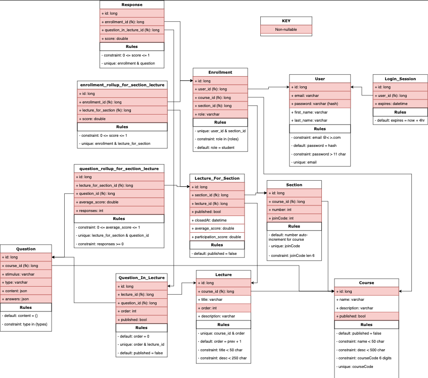

# Software Design and Architecture
## Introduction
This document outlines the architecture for a web-based classroom polling application. A well-defined architecture ensures scalability, maintainability, low latency, and reliability, which are crucial for real-time polling and feedback in a classroom setting. Though the project has already been started by previous teams, the roadmap includes integrating a Learning Management System, expanding question type support, and establishing WebSocket connections for live updates, aiming to continuously improve the system for an enhanced interactive learning experience. Moreover, the architecture should also allow modularity such that additional features can be added over time. Moreover, the architecture should maintain that the code stays readable such that contributors from the open-source community can make high-impact contributions.

## Architectural Goals and Principles
The architecture must be crafted to support a dynamic classroom polling application, addressing several key objectives. Primarily, it aims for Scalability to manage increasing user interactions and data efficiently; Security to provide a safe environment for users; Ease of Integration to allow seamless connections with third-party services or future expansions like Learning Management System (LMS) integration; Performance to ensure low latency for real-time updates and feedback; Reliability to offer a consistent user experience even under high traffic; and Maintainability to facilitate easy updates and troubleshooting. Guiding the design are principles such as Modularity, Separation of Concerns, Loose Coupling, High Cohesion, Data Integrity, and Testing and Validation. For instance, modularity allows for interchangeable components for better manageability, while a robust testing framework ensures the system's reliability and readiness for deployment. Through these guiding goals and principles, the architecture is structured to provide a resilient and adaptable foundation, promoting an interactive, real-time classroom polling environment.

## System Overview
Considering the project is already heavily underway, below I have provided a diagram that already exists for the current state of the project architecture.

The current architecture consists primarily of a frontend, backend, and database. React.js is currently being used for the frontend user interface components, which communicates in real time with the Node.js backend server. This Node.js server also interacts with the MySQL database for keeping track of students, classes, lectures, questions/answers, etc.

Over the course of this project, the goal is to include seamless integration with Canvas, both importing classes from canvas into the application, and grades from the application into Canvas.

## Architectural Patterns
The polling application employs a client-server architectural pattern, with the React.js-based frontend as the client interacting with the Node.js-based backend server, which in turn communicates with the MySQL database. This pattern is chosen for its efficiency in handling real-time interactions, crucial for the classroom polling functionality. Additionally, a static content hosting pattern is utilized for delivering unchanging UI files swiftly, reducing server load, and ensuring faster user access. These patterns align with the project's objectives of scalability, low latency, and reliability, while also setting a solid groundwork for future expansions like Learning Management System integration and WebSocket connections for live updates.

## Component Descriptions
- **User Interface (UI):** The UI, developed using React.js, is the primary point of interaction for users. It handles user inputs, displays data fetched from the backend, and provides intuitive navigation for an engaging user experience. It's also responsible for rendering real-time polling and feedback functionalities which are crucial for interactive learning within the classroom.
- **Backend Server:** The backend server, built on Node.js, is the cornerstone for processing requests originating from the UI. It implements the API logic required to facilitate classroom polling, manage user sessions, and handle data transactions. The server also interfaces with the MySQL database to fetch, update, or delete data as needed. Additionally, it takes care of authentication, session management, and ensures security measures like protection against CSRF attacks.
- **Database:** The MySQL database is the central repository for storing and managing data within the system. It holds essential data relating to students, classes, lectures, questions, and answers. Being a relational database system, it ensures data integrity, consistency, and enables complex queries to fetch or update data, supporting the robust functionality of the classroom polling application.
- **Email Notification Service:** Leveraging the Courier notification infrastructure, this component handles the emailing functionality of the application. It's configured to send out notifications to users, supporting the interactive nature of the platform. This service can be managed through environment variables set within the application, making it a flexible and crucial component for user engagement.
- **Testing Framework:** Employing Jest, the testing framework is crucial for validating the system's functionality, ensuring it meets the specified requirements and is free from bugs. It supports the maintainability and reliability of the system by allowing for rigorous testing of both the backend logic and the integration between the frontend, backend, and database.

## Data Management
The data within the current project is structured using a relational database schema, which is ideal for managing interconnected data in a systematic and organized manner. Below is a diagram of the schema explaining how data is structured, stored, and accessed within the system:

## Interface Design
The interface has already been designed, we are adding features and optimizing for performance on top of the current product. We will closely follow the current design application and adjust where instructed by our project partners. The API endpoints that we are currently using are below, although the routes and architecture may change as the project progresses further.
- POST /users
- PUT /password
- POST /authenticate
- GET, PUT, DELETE /:user_id
- GET, POST, /courses
  - /courses/:course_id/enrollments
  - /courses/:course_id/lectures
  - More endpoints to follow…
- GET, PUT, DELETE/:course_id
  - /courses/join
  - courses/:course_id/sections ( Teacher Authentication Required )
  - /courses/:course_id/sections/:section_id/lectures/
  - /courses/:course_id/questions/:question_id
  - /courses/:course_id/lectures/:lecture_id/questions/:question_id
  - /courses/:course_id/lectures/:lecture_id/question/:question_id/responses

## Considerations
### Security
Implementing cookie-based authentication alongside XSRF token validation as outlined in the project backend setup can help secure user sessions. Additionally, to separate permissions from teachers/students we have role-based access permissions which are tied to user accounts. On the topic of role-based access, there could be security concerns in both storing and retrieving user passwords in the database. To alleviate the concerns we are already using RSA256 encryption to encrypt the passwords at rest inside the database. Furthermore, we’ve taken additional measures to ensure the security of the system such as adding automated lookups of our codebase checking for common vulnerabilities.

### Performance
The current setup using Node.js and MySQL provides a solid foundation for handling real-time interactions efficiently. For better performance, considering implementing further caching mechanisms or optimizing database queries might be beneficial. With that said, the API is built to handle asynchronous requests in NodeJS which has a fairly high ceiling for load. If it were the case the steps mentioned were not enough to support daily operations then vertical and horizontal scaling can be done via a cloud provider.

### Maintenance and Support
Considering the open-source nature, there's an openness to feature requests or bug reporting, indicating a community or a team will be involved in future maintenance. Establishing a robust issue tracking and versioning system as mentioned in the SDP document can streamline this process. In regards to long term maintenance and support of the system, the project partner would likely be a good candidate. Although any member of the team can fulfill those roles. As for maintaining the system, once deployed, little will need to be done to maintain the system when using a container service such as Docker or Kubernetes.

## Deployment Strategy
This is one of the areas we want to make large improvements in, the current deployment strategy is very manual, consisting of npm install/run for multiple repos, and manual setup/configuration of the database. Considering the distributed open-source nature, we would like to greatly improve automatic setup using automation scripts and CI/CD for our testing environments. However, how the project partner decides to host the application remains to be seen.

## Testing Strategy
The Jest testing framework is already in use as per the project backend setup. Ensuring a comprehensive suite of tests including unit, integration, and end-to-end tests, along with clear documentation on how to run these tests locally and in different environments can contribute to a robust testing strategy. Additionally, the production environment will likely differ in that it will be run on a cloud provider or self-hosted environment with monitoring tools in place.
- **Local Environments:** Unit testing
- **Testing/Staging:** GitHub Actions(unit test again, integration tests)
- **Production:** The production environment will be tested through monitoring software to ensure application uptime and reliability.

## Glossary
- **API (Application Programming Interface):** A set of protocols and tools for building software applications. The API defines the methods and data formats that applications can use to request and exchange information.
- **CSRF (Cross-Site Request Forgery):** A type of malicious attack where unauthorized commands are transmitted from a user that the web application trusts.
- **HTTPS (Hypertext Transfer Protocol Secure):** A secure version of HTTP, using encryption to enhance security for communication over a computer network.
- **LMS (Learning Management System):** A software application or web-based technology used to plan, implement, and assess a specific learning process. It is used for e-learning practices and, in its most common form, consists of a server that provides specific functionalities and a user interface that is operated by instructors, students, and administrators.
- **SQL (Structured Query Language):** A domain-specific language used in programming and designed for managing and manipulating relational databases.
- **UI (User Interface):** The space where interactions between humans and machines occur. The goal of this interaction is effective operation and control of the machine from the human end, while the machine provides feedback that aids the operators' decision-making process.
